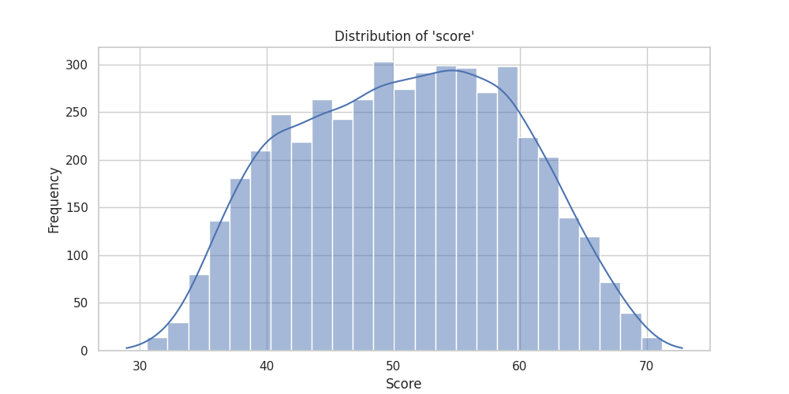

# Data Exploration and Cleaning Report

## 1. Adjusting Data Summary
- **Percentage of changed data**: 0.00%
- **Percentage of removed data**: 0.00%

## 2. Data Overview

### 2.1 Data Info
The dataset consists of the following columns with their data types:

- **rownames**: int64
- **gender**: int64
- **ethnicity**: int64
- **score**: float64
- **fcollege**: int64
- **mcollege**: int64
- **home**: int64
- **urban**: int64
- **unemp**: float64
- **wage**: float64
- **distance**: float64
- **tuition**: float64
- **education**: int64
- **income**: int64
- **region**: int64

### 2.2 Data Description
Here is a summary of the dataset's statistics for numerical columns:

| Column    | Count  | Mean      | Std Dev   | Min   | 25%    | 50%    | 75%    | Max   |
|-----------|--------|-----------|-----------|-------|--------|--------|--------|-------|
| rownames | 4739 | 3954.64 | 5953.83 | 1.00 | 1185.50 | 2370.00 | 3554.50 | 37810.00 |
| gender | 4739 | 0.45 | 0.50 | 0.00 | 0.00 | 0.00 | 1.00 | 1.00 |
| ethnicity | 4739 | 1.48 | 0.76 | 0.00 | 1.00 | 2.00 | 2.00 | 2.00 |
| score | 4739 | 50.89 | 8.70 | 28.95 | 43.92 | 51.19 | 57.77 | 72.81 |
| fcollege | 4739 | 0.21 | 0.41 | 0.00 | 0.00 | 0.00 | 0.00 | 1.00 |
| mcollege | 4739 | 0.14 | 0.34 | 0.00 | 0.00 | 0.00 | 0.00 | 1.00 |
| home | 4739 | 0.82 | 0.38 | 0.00 | 1.00 | 1.00 | 1.00 | 1.00 |
| urban | 4739 | 0.23 | 0.42 | 0.00 | 0.00 | 0.00 | 0.00 | 1.00 |
| unemp | 4739 | 7.60 | 2.76 | 1.40 | 5.90 | 7.10 | 8.90 | 24.90 |
| wage | 4739 | 9.50 | 1.34 | 6.59 | 8.85 | 9.68 | 10.15 | 12.96 |
| distance | 4739 | 1.80 | 2.30 | 0.00 | 0.40 | 1.00 | 2.50 | 20.00 |
| tuition | 4739 | 0.81 | 0.34 | 0.26 | 0.48 | 0.82 | 1.13 | 1.40 |
| education | 4739 | 13.81 | 1.79 | 12.00 | 12.00 | 13.00 | 16.00 | 18.00 |
| income | 4739 | 0.71 | 0.45 | 0.00 | 0.00 | 1.00 | 1.00 | 1.00 |
| region | 4739 | 0.20 | 0.40 | 0.00 | 0.00 | 0.00 | 0.00 | 1.00 |

### 2.3 Missing Values Summary
The following columns had missing data, which was replaced during the cleaning process:

## 3. Model Training and Evaluation

### 3.1 Model Selection
We selected **Logistic Regression** due to:
- Its interpretability and efficiency for binary classification tasks.
- Ability to provide probability estimates, which are useful for classification tasks.

### 3.2 Data Split Summary
The data was split into training and test sets is 20% for the test set.
The data was split into:
- **Training set size**: 3791
- **Test set size**: 948

### 3.3 Model Training Results
- **Training Accuracy**: 86.23054603007122%
- **Test Accuracy**: 85.86497890295358%

### 3.4 Model Evaluation Report
The model evaluation is summarized below:
- **Training Accuracy** is calculated based on the training data predictions.
- **Test Accuracy** is calculated based on the test data predictions.
- The **Classification Report** provides precision, recall, F1-score, and support metrics for each class. It helps assess the model's performance across different categories.

                  precision    recall  f1-score   support

           0       0.88      0.82      0.85       452
           1       0.84      0.90      0.87       496

    accuracy                           0.86       948
   macro avg       0.86      0.86      0.86       948
weighted avg       0.86      0.86      0.86       948

## 4. Visualizations
Here are some key visualizations for data analysis:

### 4.1 Distribution of Scores

### 4.2 Correlation Matrix

